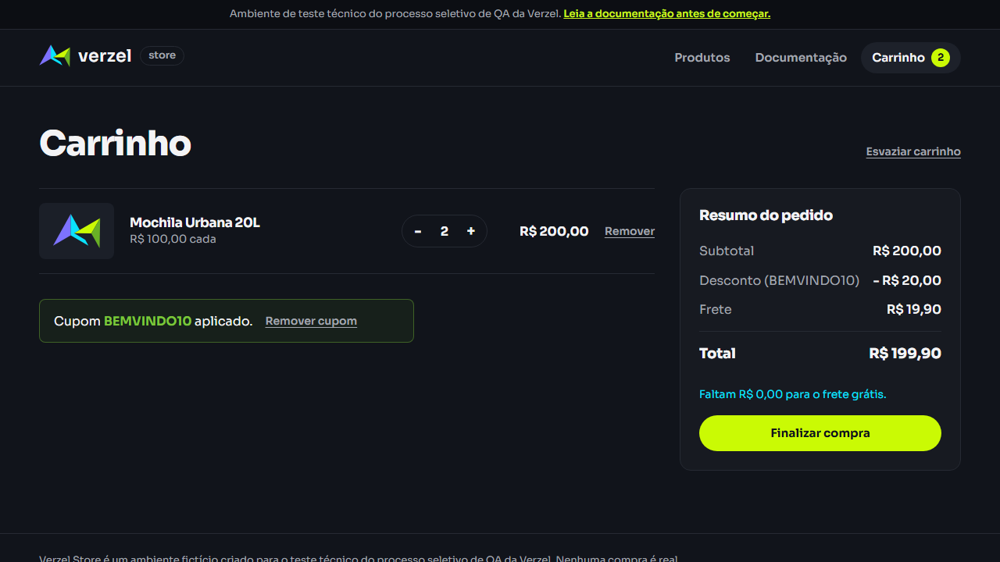
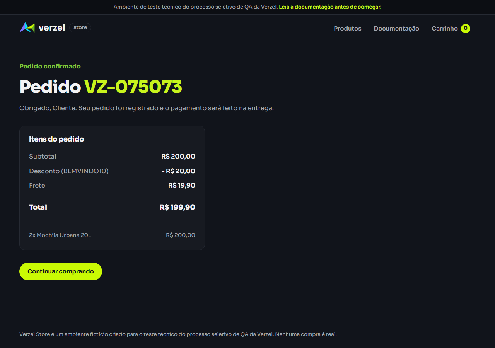

# Bugs encontrados

Resultados da execução de 07/10/2026, com evidências adicionais do BUG01 em 08/10/2026. Referência: documentação VZS-142, versão 2.3.0. As prioridades abaixo são sugestões considerando o impacto observado.

## BUG01 - Frete cobrado com subtotal de R$ 200,00

**Status:** aberto na execução registrada.

### Descrição

O carrinho cobra frete quando o subtotal chega a exatamente R$ 200,00, mesmo que esse valor já dê direito ao frete grátis. O problema acontece com e sem cupom. Ao finalizar a compra com cupom, o frete indevido também aparece no pedido confirmado.

### Ambiente

- Ambiente: loja fictícia do desafio técnico da Verzel.
- URL: https://verzel-store.qa-test-verzel-store.workers.dev/carrinho
- API: `POST https://verzel-store.qa-test-verzel-store.workers.dev/api/carrinho/calcular`
- Confirmação: `https://verzel-store.qa-test-verzel-store.workers.dev/pedido-confirmado` e `POST /api/pedidos`.
- Dispositivo: computador, perfil desktop.
- Sistema operacional: Windows. A versão não foi registrada.
- Navegador: versão não registrada.
- Verificação: conferência manual do carrinho e validação pela API.
- Datas do teste: 07/10/2026 e 08/10/2026.

### Pré-condição e dados

Começar com o carrinho vazio. Usar a Mochila Urbana 20L (P005), de R$ 100,00, e o cupom BEMVINDO10.

### Passos para reproduzir

1. Adicionar duas mochilas ao carrinho.
2. Abrir o carrinho e conferir o frete sem cupom.
3. Aplicar BEMVINDO10.
4. Conferir subtotal, desconto, frete e total.
5. Para conferir o fechamento, clicar em “Finalizar compra”, preencher Cliente Teste, rafael.teste@example.com e CEP 01310-100 e confirmar o pedido.

### O que aconteceu

Com o cupom, o subtotal ficou em R$ 200,00 e o desconto em R$ 20,00, mas foi cobrado frete de R$ 19,90. O total ficou em R$ 199,90. A tela também mostrou “Faltam R$ 0,00 para o frete grátis”.

Sem cupom, o frete também foi cobrado e o total ficou em R$ 219,90.

Na verificação de 08/10, o pedido também foi confirmado com frete de R$ 19,90 e total de R$ 199,90. A API de pedidos retornou 201 com esses mesmos valores incorretos.

### Resultado esperado

Pelas regras CA06 e CA08, o frete deve ser grátis quando o subtotal atinge R$ 200,00, antes de aplicar o desconto. O total deve ser R$ 180,00 com o cupom ou R$ 200,00 sem ele.

O pedido confirmado deve manter o frete grátis e o total correto.

### Severidade e prioridade

**Severidade alta:** o valor apresentado ao cliente fica R$ 19,90 acima do previsto na promoção.

**Prioridade alta:** afeta uma regra principal da entrega e deve ser corrigido antes da liberação.

### Evidências, logs e print

Print do carrinho:



A API reproduziu o mesmo problema. Requisição com `Content-Type: application/json`:

```json
{
  "itens": [{ "produtoId": "P005", "quantidade": 2 }],
  "cupom": "BEMVINDO10"
}
```

Trecho da resposta recebida, com status 200:

```json
{
  "subtotal": 200,
  "desconto": 20,
  "frete": 19.9,
  "freteGratis": false,
  "valorFaltanteFreteGratis": 0,
  "total": 199.9
}
```

[Requisições e respostas completas](../evidence/api/BUG01.json) · [Registro da execução da API](../evidence/api/newman-report.json)

Print do pedido confirmado na verificação adicional de 08/10:



[Requisição e resposta desse pedido](../evidence/ui/BUG01-order.json) · [Chamadas adicionais da API](../evidence/api/exploration-2026-10-08.json)

Os logs disponíveis são dos testes. Não foram coletados logs do servidor ou do console do navegador.

**Cenários relacionados:** CT09, CT11, CT16 e EXP09 da [exploração adicional](exploratory-tests.md).

## BUG02 - API aceita seis unidades do mesmo produto

**Status:** aberto na execução registrada.

### Descrição

A API permite calcular e confirmar um pedido com seis unidades do mesmo produto, acima do limite de cinco. Na tela, os botões bloqueiam corretamente a inclusão da sexta unidade.

### Ambiente

- Ambiente: API da loja fictícia do desafio técnico da Verzel.
- URL de cálculo: `https://verzel-store.qa-test-verzel-store.workers.dev/api/carrinho/calcular`
- URL de pedido: `https://verzel-store.qa-test-verzel-store.workers.dev/api/pedidos`
- Dispositivo: computador.
- Sistema operacional: Windows. A versão não foi registrada.
- Ferramenta: coleção Postman executada pelo Newman 6.2.2.
- Navegador: não se aplica; as chamadas foram feitas diretamente à API.
- Data do teste: 07/10/2026.

### Pré-condição e dados

Usar o produto P005 com quantidade 6. Para confirmar o pedido, enviar os dados fictícios de cliente abaixo. Não é necessário preparar um carrinho na tela.

### Passos para reproduzir

1. Enviar `POST` para a URL de cálculo, com `Content-Type: application/json` e este corpo:

```json
{
  "itens": [{ "produtoId": "P005", "quantidade": 6 }]
}
```

2. Conferir o status e a quantidade aceita na resposta.
3. Enviar `POST` para a URL de pedido, com o mesmo cabeçalho e este corpo:

```json
{
  "cliente": {
    "nome": "Cliente Teste",
    "email": "rafael.teste@example.com",
    "cep": "01310-100"
  },
  "itens": [{ "produtoId": "P005", "quantidade": 6 }]
}
```

4. Conferir se a API confirma o pedido.

### O que aconteceu

O cálculo retornou 200 e aceitou as seis unidades, com total de R$ 600,00. A criação retornou 201 e confirmou o pedido VZ-113922 com a mesma quantidade e total.

### Resultado esperado

Pela regra CA10, os dois endpoints devem rejeitar quantidades acima de cinco por produto, retornando 422 com `erro.codigo` igual a `QUANTIDADE_MAXIMA_EXCEDIDA`. O pedido não deve ser confirmado.

### Severidade e prioridade

**Severidade média:** permite um pedido fora do limite de quantidade, embora a tela bloqueie corretamente.

**Prioridade alta:** a validação precisa existir na API; o bloqueio da tela sozinho não garante a regra.

### Evidências, logs e print

[Requisições e respostas completas](../evidence/api/BUG02.json) · [Registro da execução da API](../evidence/api/newman-report.json)

Trechos das falhas nas validações da API:

```text
Cálculo:
expected response to have status code 422 but got 200

Pedido:
expected response to have status code 422 but got 201
```

**Print:** ainda não capturado. A evidência disponível é o registro das requisições, respostas e falhas das validações. Não foram coletados logs do servidor.

**Cenário relacionado:** CT18.
